# Clinic Appointment System - Pages Documentation

> Complete visual guide to all pages and interfaces in the Aura Health clinic management system.

---

## Table of Contents

- [Authentication Pages](#authentication-pages)
- [Patient Portal](#patient-portal)
- [Doctor Portal](#doctor-portal)
- [Receptionist Portal](#receptionist-portal)
- [Admin Dashboard](#admin-dashboard)

---

## Authentication Pages

### 1. **Login Page**

**Path:** `users/login`  
**Description:** Entry point for all users. Allows patients, doctors, receptionists, and admins to log into the system with their credentials.

**Key Features:**

- Email/Username and password input fields
- "Remember me" checkbox option
- Forgot password link
- Role-based authentication

**Screenshot:**
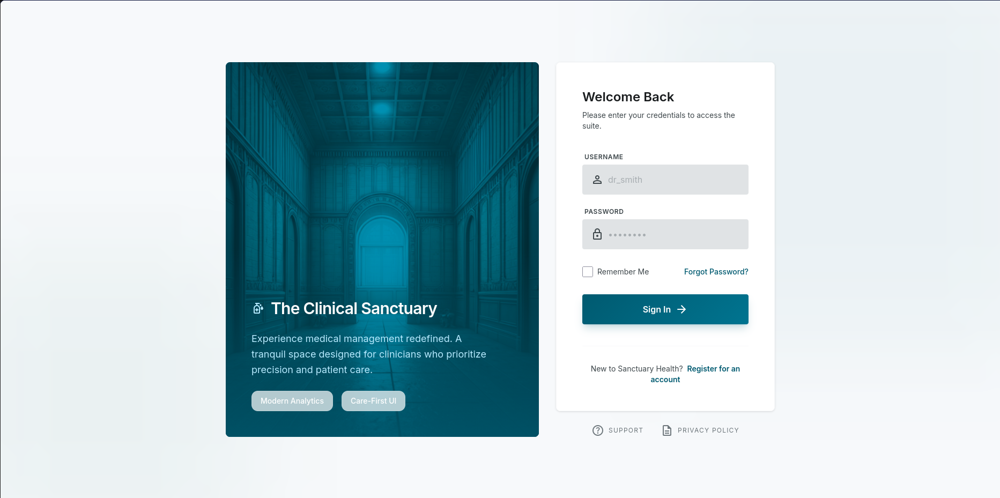

---

### 2. **Registration Page**

**Path:** `users/register`  
**Role:** Patient  
**Description:** New patients can create an account in the clinic system.

**Key Features:**

- Personal information form (name, email, phone, date of birth)
- Blood type selection
- National ID input
- Password creation with confirmation
- Terms and conditions acceptance

**Screenshot:**
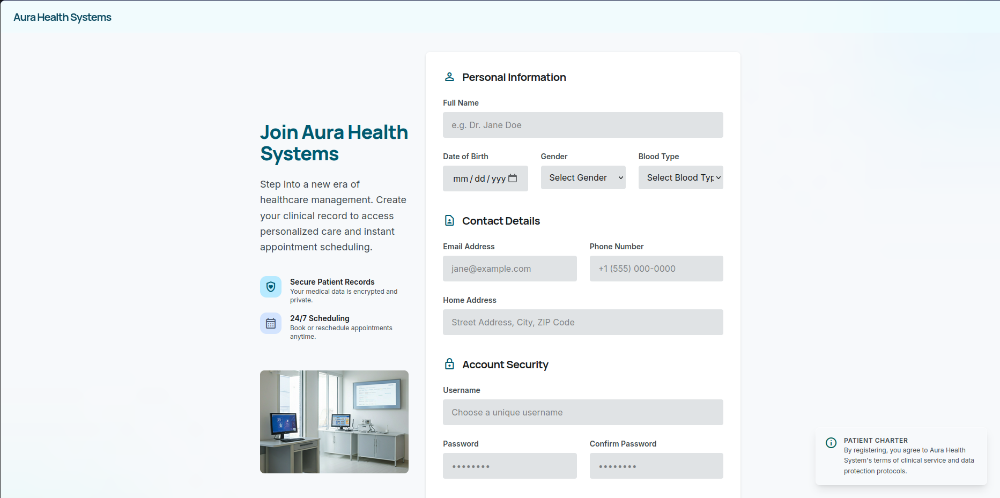

---

### 3. **Forgot Password Page**

**Path:** `users/forgot-password`  
**Description:** Users can request a password reset by entering their email address.

**Key Features:**

- Email input field
- Send reset link button
- Back to login link

**Screenshot:**
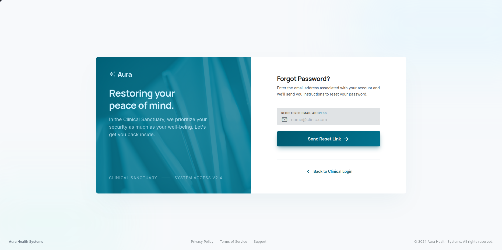

---

### 4. **Password Reset Confirmation**

**Path:** `/password-reset-confirm/<token>`  
**Description:** Users reset their password using the link from email.

**Key Features:**

- New password input field
- Confirm password field
- Password strength indicator
- Submit button

**Screenshot:**
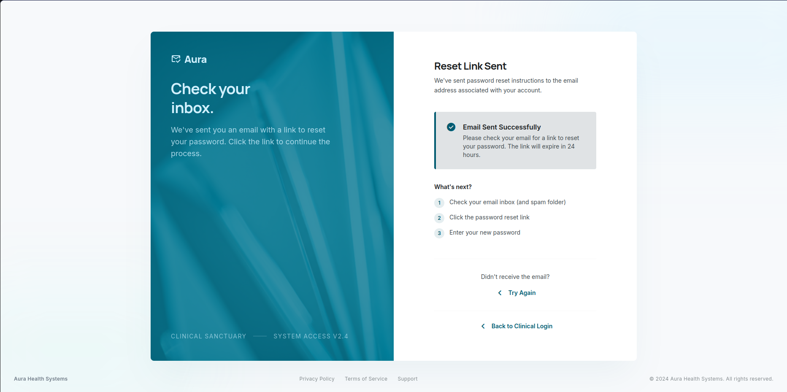

### 5. **Email Confirmation**

**Descprition:** Users get the conformation email and redirect to the set new password page

**Screenshot:**
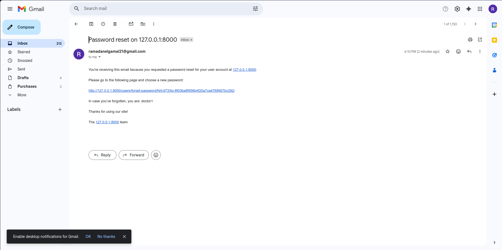

### 6. **Setting new Password**
**Path:** `/password-reset-confirm/<token>`  
**Description:** Users set their new password after confirming their email.

**Key Features:**
- New password input field
- Confirm password field
- Password strength indicator
- Submit button

**Screenshot:**
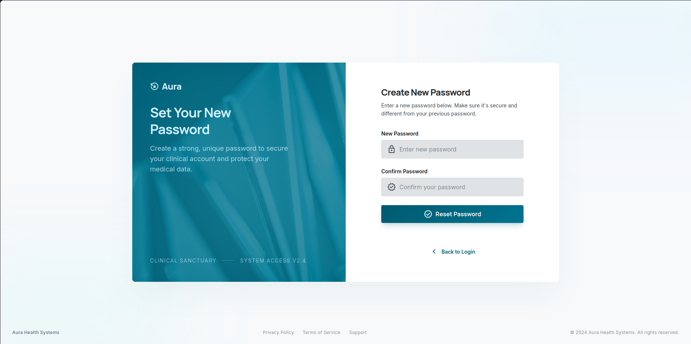
---

## Patient Portal

### 1. **Patient Dashboard**

**Path:** `/patient/dashboard`  
**Role:** Patient  
**Description:** Main hub for patients showing their account overview and quick actions.

**Key Features:**

- Upcoming appointments count
- Past appointments overview
- Quick action buttons (Book Appointment, View History)
- Health records summary
- Notifications badge

**Screenshot:**
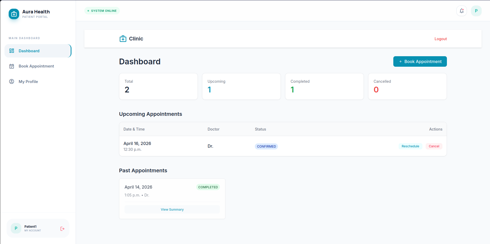

---

### 2. **Book Appointment Page**

**Path:** `/patient/book-appointment`  
**Role:** Patient  
**Description:** Interface for patients to book appointments from available time slots.

**Key Features:**

- Doctor selection dropdown
- Calendar date picker
- Availability time slots display
- Appointment type selection
- Booking confirmation
- Prevention of overlapping appointments

**Screenshot:**
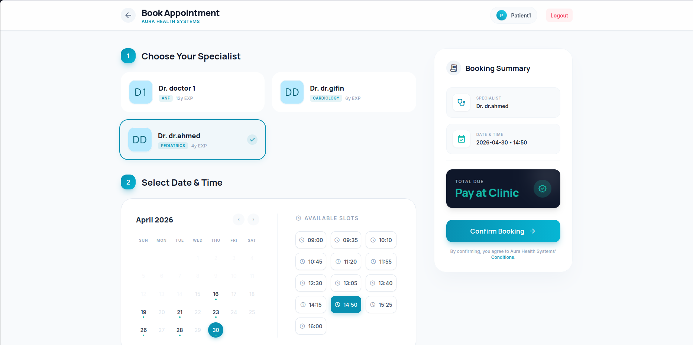

---

### 3. **Consultation/Medical Record View**

**Path:** `/patient/consultation/<appointment_id>`  
**Role:** Patient  
**Description:** Patient view-only summary of their completed consultation.

**Key Features:**

- Diagnosis information (read-only)
- Clinical notes (read-only)
- Prescribed medications list
- Recommended tests list
- Follow-up instructions
- Download record button

**Screenshot:**
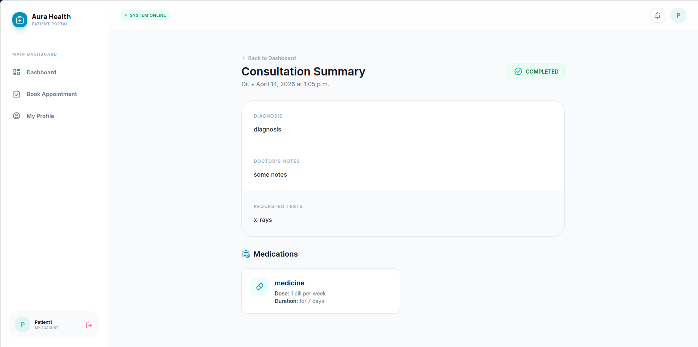

---

### 4. **Patient Profile**

**Path:** `/patient/profile`  
**Role:** Patient  
**Description:** Patient can view and manage their personal information.

**Key Features:**

- Personal information (name, email, phone, DOB, blood type)
- Change password option
- Account settings

**Screenshot:**
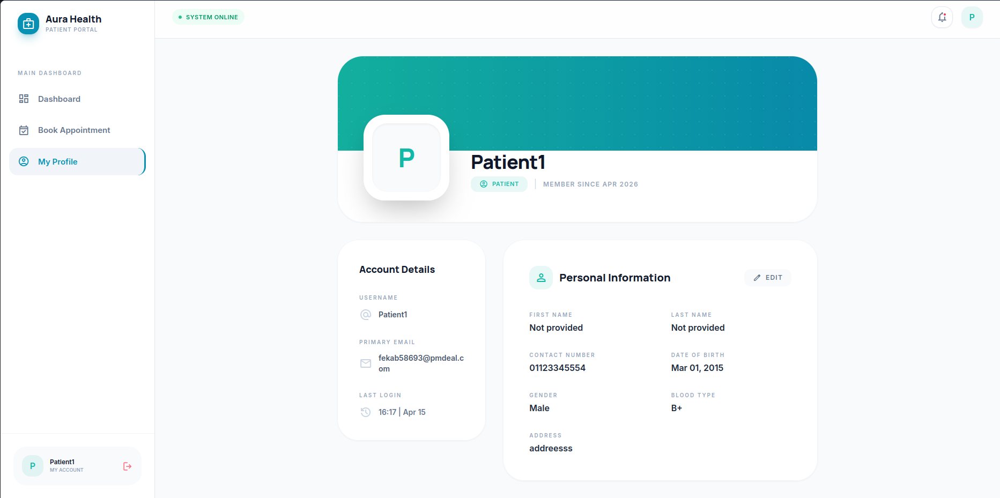

---

## Doctor Portal

### 1. **Doctor Dashboard / Daily Queue**

**Path:** `/doctor/dashboard`  
**Role:** Doctor  
**Description:** Daily overview of scheduled patients and their status for the day.

**Key Features:**

- Today's patient count
- Statistics (Total, Waiting, Completed, Upcoming)
- Real-time patient queue list
- Patient details (name, ID, appointment time)
- Patient status badge
- Action buttons (Check-in, No-show, View Medical Record)

**Screenshot:**
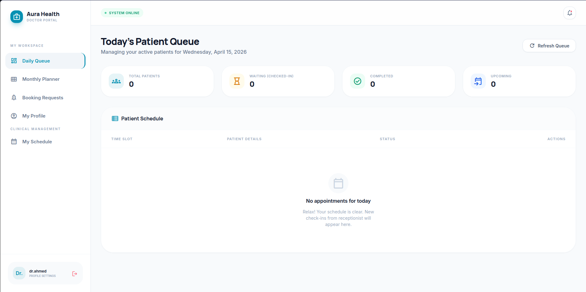

---

### 2. **Pending Bookings/Booking Requests**

**Path:** `/doctor/booking-requests`  
**Role:** Doctor  
**Description:** Manage new appointment requests from patients awaiting doctor approval.

**Key Features:**

- List of pending booking requests
- Patient information (name, ID, blood type)
- Requested appointment date and time
- Approve button
- Decline button
- Filters for request status

**Screenshot:**
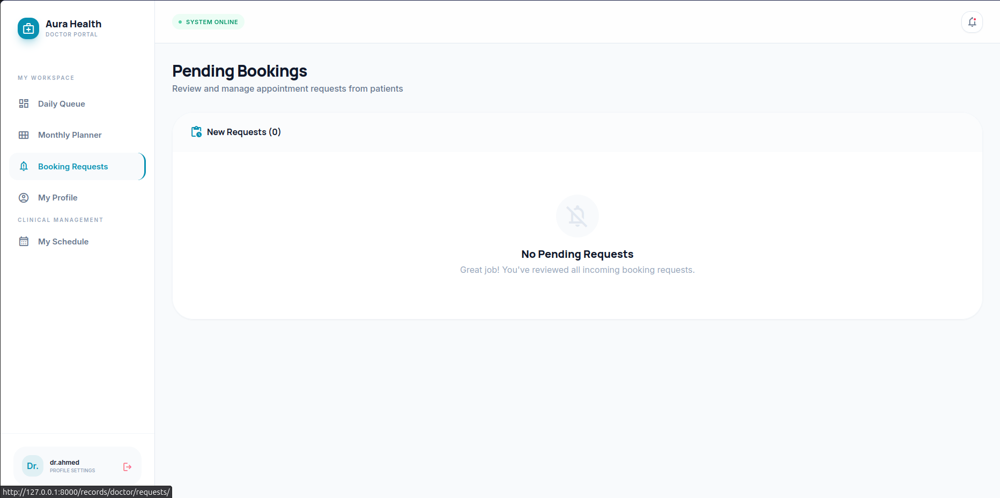

---

### 3 **Doctor weekly schedule**
**Path:** `/doctor/schedule`  
**Role:** Doctor  
**Description:** Weekly calendar view of doctor's availability and scheduled appointments.

**Key Features:**
- Calendar view of the week
- Color-coded appointment blocks
- Days off highlighting 
- Available slots visualization
- Click on date to see details

**Screenshot:**

---

### 4. **Monthly Planner / Schedule**

**Path:** `/doctor/schedule`  
**Role:** Doctor  
**Description:** Monthly calendar view of doctor's availability and scheduled appointments.

**Key Features:**

- Calendar view of the month
- Color-coded appointment blocks
- Days off highlighting
- Available slots visualization
- Appointment density view
- Click on date to see details
- Edit availability button

**Screenshot:**
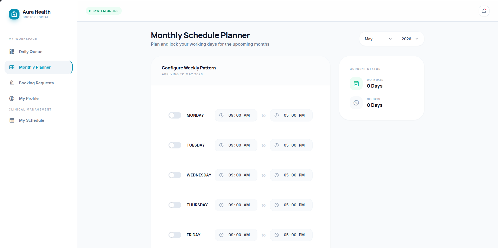

---

### 5. **Doctor Profile**

**Path:** `/doctor/profile`  
**Role:** Doctor  
**Description:** Doctor's profile management and personal information.

**Key Features:**

- Profile picture upload
- Personal information (name, email, phone, specialization)
- License/credential information
- Availability settings
- Bio/About section
- Change password
- Notification preferences

**Screenshot:**
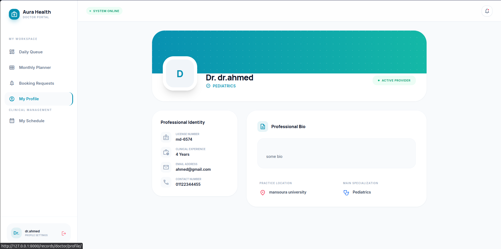

---

## Receptionist Portal

### 1. **Receptionist Queue/Reception Hub**

**Path:** `/receptionist/queue`  
**Role:** Receptionist  
**Description:** Manage patient check-ins and queue for the current day.

**Key Features:**

- Statistics (Checked In Waiting, Total Scheduled)
- Time slot grouping
- Patient list with:
  - Time slot
  - Patient details
  - Assigned doctor
  - Status badge
  - Wait time counter
  - Action buttons (Check-in, Move, View Details)
- Search functionality (patient name or doctor)
- Real-time status updates

**Screenshot:**
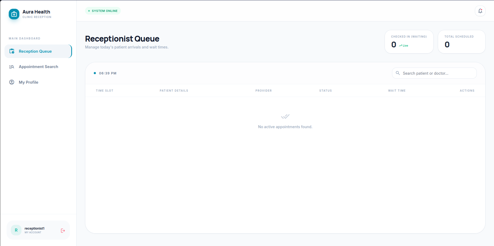

---

### 2. **Appointment Search & Management**

**Path:** `/receptionist/appointments`  
**Role:** Receptionist  
**Description:** Search and manage appointments for various operations.

**Key Features:**

- Advanced search filters:
  - By date range
  - By patient name
  - By doctor
  - By status
- Search results table
- Reschedule appointment option
- Cancel appointment option
- View appointment details
- Export to CSV button

**Screenshot:**
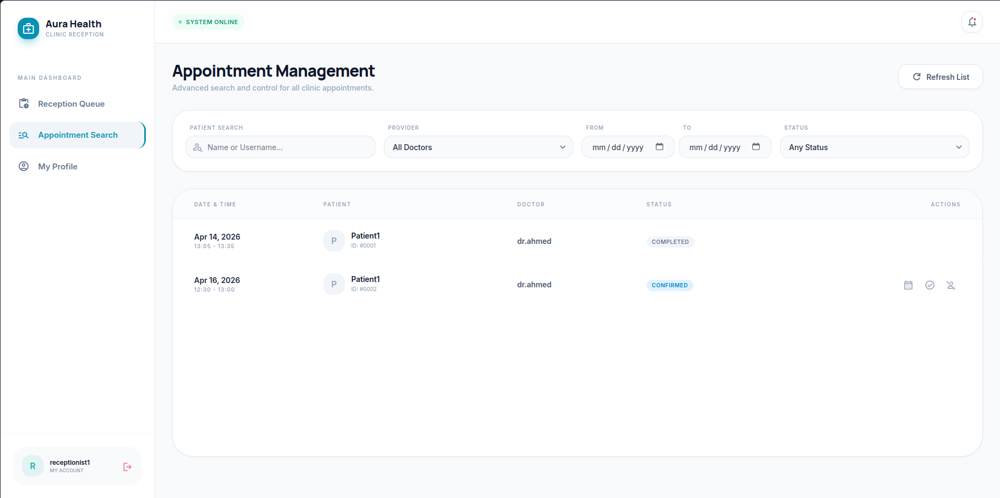

---

### 3. **Receptionist Profile**

**Path:** `/receptionist/profile`  
**Role:** Receptionist  
**Description:** Receptionist's personal profile and settings.

**Key Features:**

- Profile picture
- Personal information
- Contact details
- Work schedule
- Change password
- Account preferences

**Screenshot:**
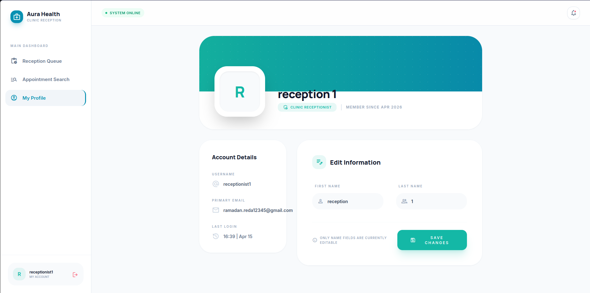

---

## Admin Dashboard

### 1. **Admin Dashboard**

**Path:** `/admin/dashboard`  
**Role:** Admin  
**Description:** Executive overview of clinic operations and key metrics.

**Key Features:**

- Total users count
- Active appointments count
- Revenue/bookings statistics
- System status
- Recent activities feed
- Quick navigation to management sections
- Charts and graphs

**Screenshot:**
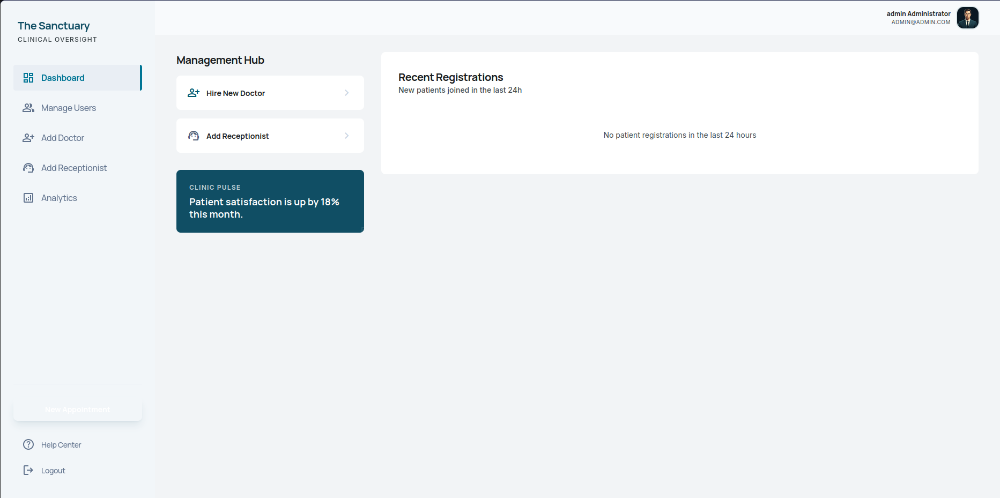

---

### 2. **User Management**

**Path:** `/admin/users`  
**Role:** Admin  
**Description:** Comprehensive user management interface for all system users.

**Key Features:**

- User list with filtering:
  - By role (Doctor, Patient, Receptionist, Admin)
  - By status (Active, Inactive)
  - By date joined
- Search functionality
- Add new user button
- Edit user information button
- Deactivate/activate user
- Delete user
- View user details modal
- Export users list

**Screenshot:**
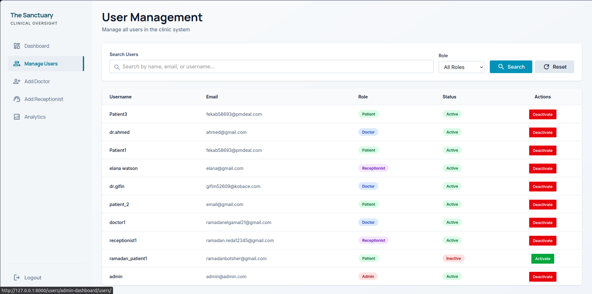

---

### 3. **Analytics Dashboard**

**Path:** `/admin/analytics`  
**Role:** Admin  
**Description:** Detailed analytics and reporting on clinic performance.

**Key Features:**

- Appointment statistics:
  - Total appointments
  - Completed vs Cancelled
  - Peak hours analysis
- Doctor performance metrics:
  - Appointments per doctor
  - Completion rates
- Patient insights:
  - New patients per month
  - Return patients ratio
- Graphs and charts:
  - Line charts for trends
  - Bar charts for comparisons
  - Pie charts for distribution
- Date range selector
- Export analytics data
- Custom report builder

**Screenshot:**
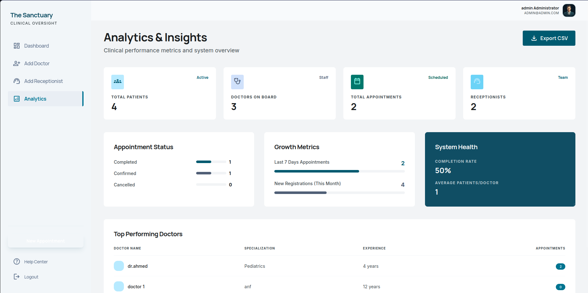

---

### 4. **Doctor Hiring**
**Path:** `/admin/doctor-hiring`  
**Role:** Admin  
**Description:** Interface for managing doctor hiring applications and processes.

**Key Features:**
- List of doctor applications
- Application details view
- Approve or reject applications
- Schedule interviews
- Track hiring status

**Screenshot:**
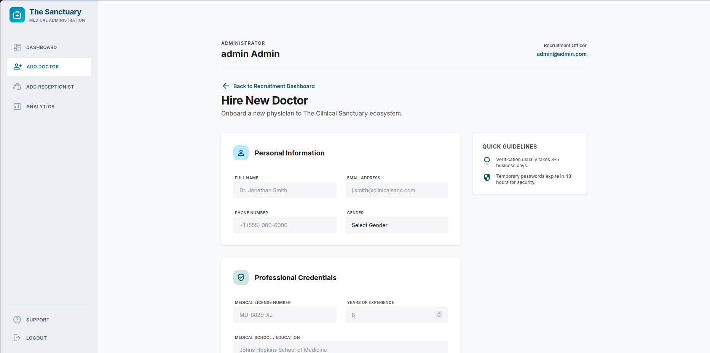
---

### 5. **Receptionist Hiring**
**Path:** `/admin/receptionist-hiring` 
**Role:** Admin
**Description:** Interface for managing receptionist hiring applications and processes.

**Key Features:**
- List of receptionist applications
- Application details view
- Approve or reject applications
- Schedule interviews
- Track hiring status

**Screenshot:**
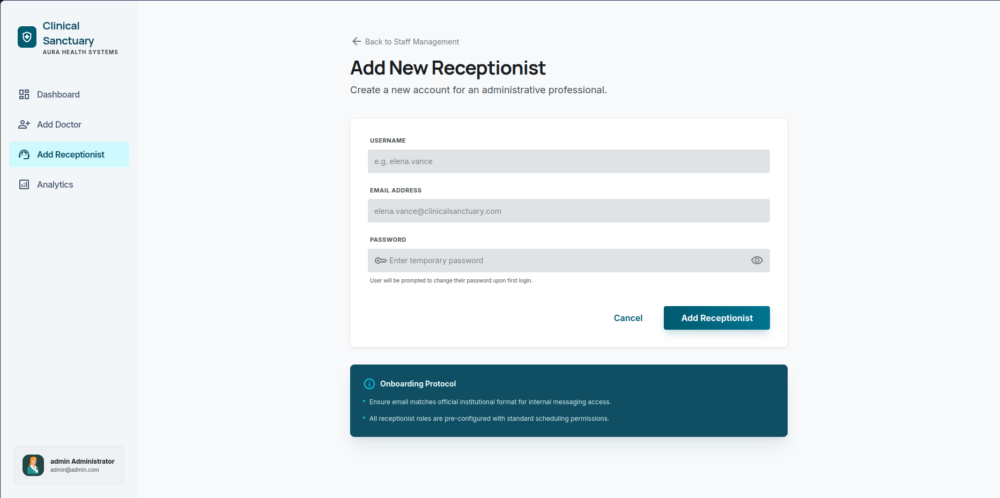
---

## Key Features Across All Pages

### Security & Access Control

- Role-based access control (RBAC)
- User authentication required
- Session management
- Permission-based feature visibility

### User Experience

- Responsive design for all devices
- Real-time notifications
- Consistent navigation menu
- User profile dropdown in header
- Logout functionality
- Breadcrumb navigation

### System Status

- "System Online" indicator
- Notification badges
- User status indicators
- Appointment status badges

### Common Actions

- **Search:** Available on most list pages
- **Filter:** Date range, status, category filters
- **Export:** CSV export for data tables
- **Sort:** Sortable columns on tables
- **Pagination:** For large data sets

---

## Appointment Status Flow

```
REQUESTED → CONFIRMED → CHECKED_IN → COMPLETED
   ↓            ↓            ↓          (OR)
DECLINED   CANCELLED    NO_SHOW    PENDING_RECORD
```

### Status Descriptions:

- **REQUESTED:** Initial booking request from patient
- **CONFIRMED:** Doctor/Receptionist approved the appointment
- **CHECKED_IN:** Patient has arrived and checked in
- **COMPLETED:** Appointment finished, medical record created
- **NO_SHOW:** Patient didn't attend
- **DECLINED:** Doctor rejected the booking request
- **CANCELLED:** Patient or staff cancelled the appointment
- **PENDING_RECORD:** Appointment done but medical record not finalized

---

## Navigation Structure

### Patient Navigation

```
Dashboard → Book Appointment
         → My Appointments
         → Consultations/Records
         → Profile
         → Logout
```

### Doctor Navigation

```
Daily Queue → Booking Requests
           → Diagnosis Form
           → Schedule/Monthly Planner
           → Profile
           → Logout
```

### Receptionist Navigation

```
Queue → Appointment Search
     → Dashboard
     → Profile
     → Logout
```

### Admin Navigation

```
Dashboard → User Management
         → Analytics
         → Doctor Schedule
         → Audit Trail
         → Profile
         → Logout
```

---

## Notes

- All timestamps are displayed in the local clinic timezone
- Forms include client and server-side validation
- Real-time updates are implemented using WebSockets for queue management
- All sensitive data is encrypted and stored securely
- Session timeout: Configurable in settings (default 30 minutes of inactivity)
- Two-factor authentication available for admin accounts

---

**Last Updated:** April 2026  
**System Version:** 1.0.0
